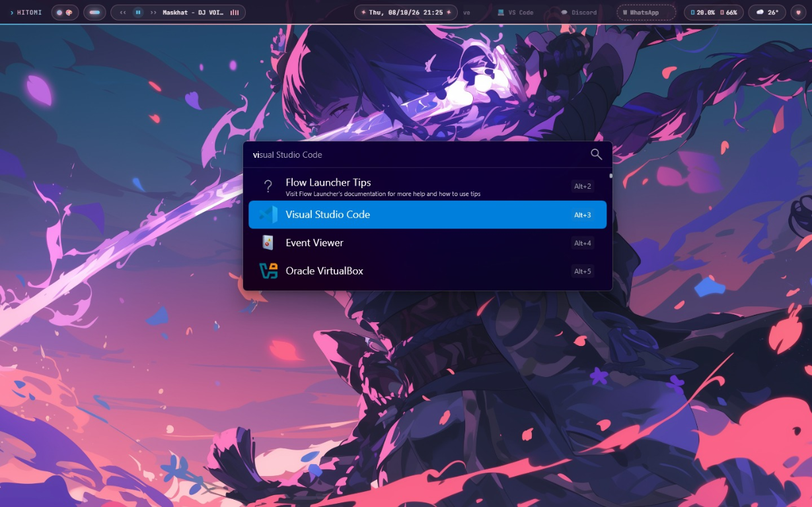

# HitomiZebar

A pink, Hyprland-inspired status bar for [Zebar](https://github.com/glzr-io/zebar), designed to work with [GlazeWM](https://github.com/glzr-io/glazewm).

## Preview



## Requirements

- Windows
- [Zebar](https://github.com/glzr-io/zebar/releases) installed
- [GlazeWM](https://github.com/glzr-io/glazewm) installed and running
- An internet connection when the widget starts (React, Zebar, Babel, and the font are loaded from online CDNs)

## Install

1. Install and launch Zebar and GlazeWM.
2. Download this repository using **Code → Download ZIP**, then extract it.
3. Copy the `HitomiZebar` folder into Zebar's widget directory:

   ```text
   %USERPROFILE%\.glzr\zebar\hitomizebar
   ```

   If the `zebar` directory does not exist yet, create it. The final folder should contain `zpack.json`, `with-glazewm.html`, and `styles.css` directly (not inside an extra nested folder).
4. Open Zebar from the system tray and go to **My widgets**. The pack should appear as **hitomi**.
5. Start the **hitomi-bar** widget. To start it automatically, right-click the Zebar tray icon and select **Widget packs → hitomi → hitomi-bar → Run on startup**.

The bar uses the GlazeWM provider, so workspace and window features require GlazeWM to be running. Some buttons also send commands to GlazeWM.

## Files

- `zpack.json` — Zebar widget-pack configuration
- `with-glazewm.html` — widget markup and behavior
- `styles.css` — widget styling
